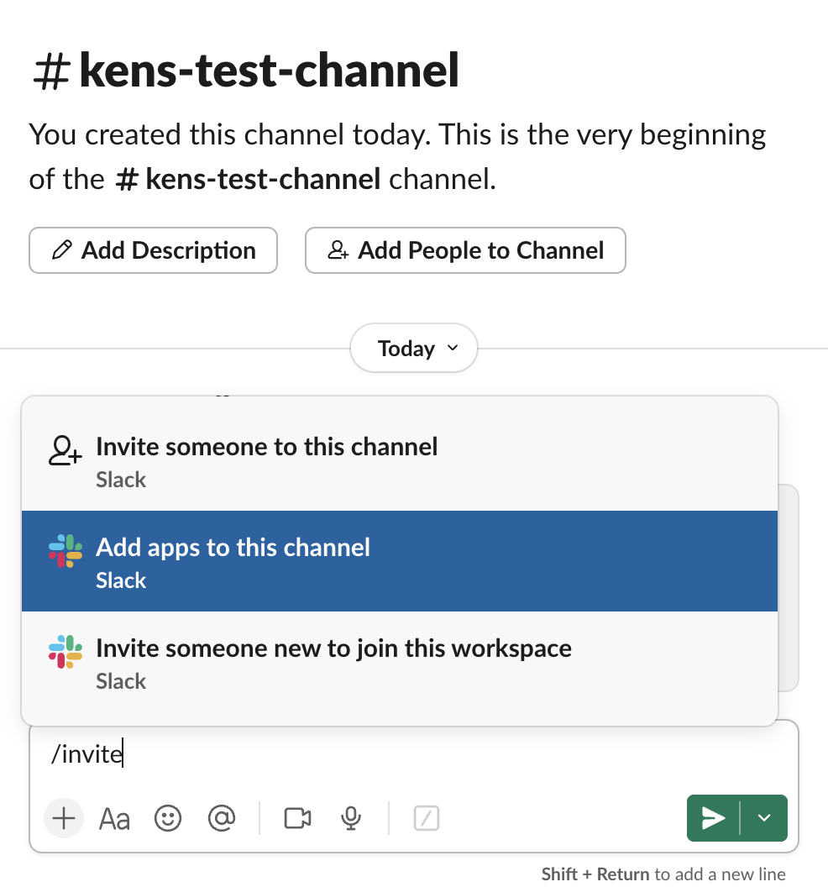

# Slack Notification Function

[Explore all examples](https://github.com/sanity-io/sanity/tree/main/examples)

## Problem

Content teams need to stay informed when new content is published, but manually notifying team members about updates is time-consuming and often forgotten. Teams want automatic notifications that include relevant details and quick access links to both the published content and the studio for further editing.

## Solution

This function automatically sends Slack notifications when content is published using Sanity's document functions and the Slack Web API. When triggered, it sends a formatted message to a designated Slack channel with the post title, publication date, and convenient links to both the published webpage and the studio editor.

## Benefits

- Keeps teams instantly informed about published content
- Provides quick access links to both published content and studio
- Reduces manual notification overhead
- Helps maintain team awareness of content publishing activity
- Enables faster response times for content review and promotion

## Compatible Templates

This function is built to be compatible with any of [the official "clean" templates](https://github.com/sanity-io/sanity-template-nextjs-clean) that include post documents with title and slug fields. We recommend testing the function out in one of those after you have installed them locally.

### Schema Requirements

This function expects your post schema to include:

- `title` field (string)
- `slug` field (slug type with `current` property)

Most official templates already include these fields.

## Implementation

1. **Set up Slack Integration**

   First, create a Slack app and get an OAuth token:

   1. **Create a new Slack app:**

      - Go to [https://api.slack.com/apps](https://api.slack.com/apps)
      - Click "Create New App"
      - Choose "From scratch"
      - Give your app a descriptive name (e.g., "Sanity Content Notifications")
      - Select your workspace from the dropdown

   2. **Configure permissions:**

      - Once your app is created, go to "OAuth & Permissions" in the sidebar
      - Scroll down to the "Scopes" section
      - Under "Bot Token Scopes", click "Add an OAuth Scope"
      - Add the `chat:write` permission (this allows your bot to send messages).

   3. **Install the app:**

      - Click "Install to Workspace" at the top of the OAuth & Permissions page
      - Review the permissions and click "Allow"
      - Copy the "Bot User OAuth Token" that starts with `xoxb-` (you'll need this for the next step)

   4. **Invite the app to your channel:**

      - Go to the Slack channel where you want notifications (e.g., `#test-channel`)
      - Type `/invite @your-app-name` or click the channel name → Settings → Integrations → Add apps
      - Select your newly created app to add it to the channel

      {width=600}

2. **Initialize the example**

   For a new project:

   ```bash
   npx sanity blueprints init --example slack-notification
   ```

   For an existing project:

   ```bash
   npx sanity blueprints add function --example slack-notification
   ```

3. **Add configuration to your blueprint**

   ```ts
   // sanity.blueprint.ts
   import {defineBlueprint, defineDocumentFunction} from '@sanity/blueprints'

   export default defineBlueprint({
     resources: [
       defineDocumentFunction({
         type: 'sanity.function.document',
         name: 'slack-notification',
         src: './functions/slack-notification',
         memory: 1,
         timeout: 10,
         event: {
           on: ['publish'],
           filter: "_type == 'post'",
           projection: '_id, title, slug, _updatedAt',
         },
       }),
     ],
   })
   ```

4. **Install dependencies**

   Install dependencies in the project root:

   ```bash
   npm install @sanity/functions
   npm install
   ```

   And install function dependencies:

   ```bash
   cd functions/slack-notification
   npm install
   cd ../..
   ```

## Testing the function locally

You can test the slack-notification function locally using the Sanity CLI before deploying it to production.

**Important:** This function requires a valid Slack OAuth token and will send real messages to your Slack channel during testing. You'll need to provide the `SLACK_OAUTH_TOKEN` environment variable directly in each command.

### 1. Basic Function Test

Test the function with the created document (from project root):

```bash
SLACK_OAUTH_TOKEN=slack-OAuth-token npx sanity functions test slack-notification --file functions/slack-notification/document.json
```

**Alternative:** Test with a real document from your dataset:

```bash
# From the studio/ folder, find and export an existing post document
cd studio
npx sanity documents query "*[_type == 'post'][0]" > ../real-post.json

# Back to project root for function testing
cd ..
SLACK_OAUTH_TOKEN=slack-OAuth-token npx sanity functions test slack-notification --file real-post.json
```

### 2. Test Without Sending Messages

To test the function logic without actually sending Slack messages, you can temporarily comment out the `slack.chat.postMessage` call in the function and just log the message that would be sent.

### 3. Interactive Development Mode

Start the development server for interactive testing:

```bash
SLACK_OAUTH_TOKEN=slack-OAuth-token npx sanity functions dev
```

This opens an interactive playground where you can test functions with custom data

### Testing Tips

- **Use a test Slack channel** - Create a dedicated test channel for development
- **Test with real Slack tokens** - The function requires a valid OAuth token to work
- **Monitor Slack during testing** - Watch your designated channel for test messages
- **Test edge cases** - Try documents without titles or slugs to ensure graceful handling

## Requirements

- A Sanity project
- A Slack workspace with admin permissions to create apps
- Slack OAuth token with `chat:write` permissions
- Post schema with `title` and `slug` fields
- Node.js v22.x for local testing

## Usage Example

When you publish a post document, the function automatically:

1. Extracts the post title, slug, and publication time
2. Formats a Slack message with this information
3. Sends the message to the configured Slack channel
4. Includes links to both the published webpage and studio editor

Example Slack message:

```
*New Document Published!*
Title: Getting Started with Sanity
Webpage: <http://localhost:3000/posts/getting-started-with-sanity|Click Here>
Studio: <http://localhost:3333/structure/post;post-id|Click Here>
DateTime Published: 1/15/2024, 10:30:00 AM
```

## Customization

### Change URLs and Slack channel

You can customize the notification by modifying the configuration constants at the top of the function:

```typescript
// Configuration constants
const baseUrl = 'https://your-domain.com' // Update to your production URL
const studioUrl = 'https://your-studio.sanity.studio' // Update to your studio URL
const slackChannel = 'your-channel-name' // Update to your target channel
```

### Modify the message format

```typescript
text: `Your custom message format with ${event.data.title}`,
```

### Add more document fields

Include additional fields in the message by accessing `event.data.fieldName`

### Change notification triggers

Modify the `filter` in the blueprint configuration to target different document types or conditions

## Troubleshooting

### Common Issues

**Error: "An API error occurred: invalid_auth"**

- Cause: Invalid or missing Slack OAuth token
- Solution: Verify your token is correct and has proper permissions

**Error: "An API error occurred: channel_not_found"**

- Cause: The specified channel doesn't exist or the bot doesn't have access
- Solution: Ensure the channel exists and invite your Slack app to the channel

**Error: "Missing environment variable SLACK_OAUTH_TOKEN"**

- Cause: The Slack token environment variable is not set
- Solution: Set the `SLACK_OAUTH_TOKEN` environment variable with your bot token

**Messages not appearing in Slack**

- Cause: Bot doesn't have permissions or isn't in the channel
- Solution: Invite the bot to your target channel and ensure it has `chat:write` permissions
