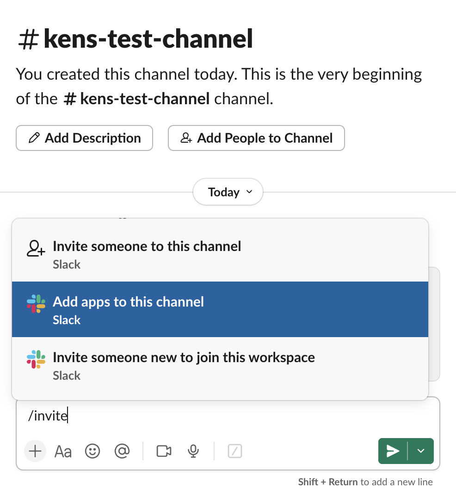

# Slack Notification Function

**📖 [← Back to Functions Overview](../README.md)**

## Overview

**Problem:** Content teams need to stay informed when new content is published, but manually notifying team members about updates is time-consuming and often forgotten. Teams want automatic notifications that include relevant details and quick access links to both the published content and the studio for further editing.

**Solution:** This function automatically sends Slack notifications when content is published using Sanity's document functions and the Slack Web API. When triggered, it sends a formatted message to a designated Slack channel with the post title, publication date, and convenient links to both the published webpage and the studio editor.

**Benefits:**

- **Keeps teams instantly informed** about published content
- **Provides quick access links** to both published content and studio
- **Reduces manual notification overhead**
- **Helps maintain team awareness** of content publishing activity
- **Enables faster response times** for content review and promotion

## Schema Requirements

This function expects your post schema to include:

- `title` field (string)
- `slug` field (slug type with `current` property)

Most official templates already include these fields.

## Slack Integration Setup

### Step 1: Create a Slack App

1. **Create a new Slack app:**

   - Go to [https://api.slack.com/apps](https://api.slack.com/apps)
   - Click "Create New App"
   - Choose "From scratch"
   - Give your app a descriptive name (e.g., "Sanity Content Notifications")
   - Select your workspace from the dropdown

2. **Configure permissions:**

   - Once your app is created, go to "OAuth & Permissions" in the sidebar
   - Scroll down to the "Scopes" section
   - Under "Bot Token Scopes", click "Add an OAuth Scope"
   - Add the `chat:write` permission (this allows your bot to send messages).

3. **Install the app:**

   - Click "Install to Workspace" at the top of the OAuth & Permissions page
   - Review the permissions and click "Allow"
   - Copy the "Bot User OAuth Token" that starts with `xoxb-` (you'll need this for deployment)

4. **Invite the app to your channel:**

   - Go to the Slack channel where you want notifications (e.g., `#content-updates`)
   - Type `/invite @your-app-name` or click the channel name → Settings → Integrations → Add apps
   - Select your newly created app to add it to the channel

   

### Step 2: Configure Environment Variables

After deploying your function, add the Slack OAuth token:

```bash
npx sanity functions env add slack-notify SLACK_OAUTH_TOKEN "your-slack-oauth-token-here"
```

## Function Configuration

```ts
// sanity.blueprint.ts
defineDocumentFunction({
  type: 'sanity.function.document',
  name: 'slack-notify',
  src: './functions/slack-notify',
  memory: 1,
  timeout: 10,
  event: {
    on: ['publish'],
    filter: "_type == 'post'",
    projection: '_id, title, slug, _updatedAt',
  },
})
```

## How It Works

When you publish a post document, the function automatically:

1. **Extracts** the post title, slug, and publication time
2. **Formats** a Slack message with this information
3. **Sends** the message to the configured Slack channel
4. **Includes** links to both the published webpage and studio editor

**Example Slack message:**

```
*New Document Published!*
Title: Getting Started with Sanity
Webpage: <http://localhost:3000/posts/getting-started-with-sanity|Click Here>
Studio: <http://localhost:3333/structure/post;post-id|Click Here>
DateTime Published: 1/15/2024, 10:30:00 AM
```

## Customization Options

### Change URLs and Slack Channel

Modify the configuration constants in the function code:

```typescript
// Configuration constants
const baseUrl = 'https://your-domain.com' // Update to your production URL
const studioUrl = 'https://your-studio.sanity.studio' // Update to your studio URL
const slackChannel = 'your-channel-name' // Update to your target channel
```

### Modify Message Format

```typescript
text: `Your custom message format with ${event.data.title}`,
```

### Add More Document Fields

Include additional fields in the message by:

1. Adding them to the `projection` in your blueprint configuration
2. Accessing them via `event.data.fieldName` in the function

### Change Notification Triggers

Modify the `filter` in the blueprint configuration to target different document types or conditions:

```typescript
filter: "_type == 'article' && defined(slug)"
```

## Special Requirements

- **Slack workspace** with admin permissions to create apps
- **Slack OAuth token** with `chat:write` permissions
- **SLACK_OAUTH_TOKEN** environment variable configured

## Common Issues

**Error: "An API error occurred: invalid_auth"**

- **Solution:** Verify your token is correct and has proper permissions

**Error: "An API error occurred: channel_not_found"**

- **Solution:** Ensure the channel exists and invite your Slack app to the channel

**Error: "Missing environment variable SLACK_OAUTH_TOKEN"**

- **Solution:** Set the environment variable using `npx sanity functions env add`

**Messages not appearing in Slack**

- **Solution:** Invite the bot to your target channel and ensure it has `chat:write` permissions

## Implementation & Testing

For complete implementation, testing, and deployment instructions, see the [Functions Overview](../README.md).

**Quick Start:**

1. Install: `npx sanity blueprints add function --example slack-notify`
2. Follow the [Slack Integration Setup](#slack-integration-setup) above
3. Follow the [Implementation Guide](../README.md#implementation-guide)
4. Test locally using the [Testing Guide](../README.md#testing-functions-locally)
5. Deploy using the [Deployment Guide](../README.md#deployment-guide)
6. Add environment variables as described above

**Testing Note:** This function will send real messages to your Slack channel during testing. Use a test channel for development.
