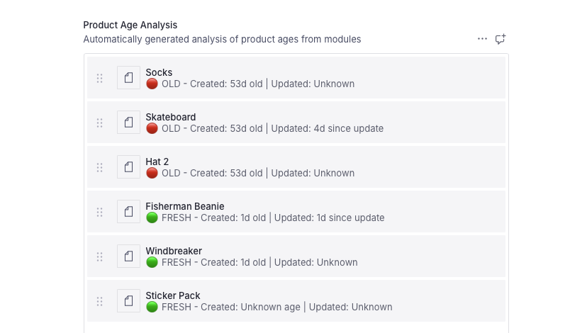

# Stale Products Analysis Function

[Explore all examples](https://github.com/sanity-io/sanity/tree/main/examples)



## Problem

E-commerce teams need to monitor the freshness of products featured on their pages to ensure they're showcasing current and relevant items. Manually tracking product ages and identifying stale content across page modules is time-consuming and often overlooked, leading to outdated product displays that can negatively impact user experience and sales.

## Solution

This Sanity Function automatically analyzes the age of products referenced in page modules whenever a page is updated. It calculates how long products have been in the system, identifies stale products (older than 30 days), and stores this analysis data directly on the page document for easy monitoring and reporting.

## Benefits

- **Automated freshness monitoring** by calculating product ages automatically
- **Stale content identification** by flagging products older than 30 days
- **Data-driven decisions** with comprehensive age analysis and statistics
- **Page optimization** by providing insights to keep featured content fresh
- **Scalable monitoring** that works across all page product references

## Compatible Templates

This function is built to be compatible with the Sanity E-commerce Shopify template. It works specifically well with page documents that have `modules` containing product references in a grid layout structure. Install this template with: `npm create sanity@latest -- --template "shopify"`

### Adding required schema field to your project

You'll need to add a `productAgeAnalysis` field to your `page` document schema:

```typescript
defineField({
      name: 'modules',
      type: 'array',
      description: 'Editorial modules to associate with this collection',
      of: [
        defineArrayMember({type: 'grid'}),
        // Additional types can be added
      ],
      group: 'editorial',
    }),

defineField({
  name: 'productAgeAnalysis',
  title: 'Product Age Analysis',
  type: 'array',
  of: [
    {
      type: 'object',
      fields: [
        {
          name: 'product',
          title: 'Product',
          type: 'reference',
          to: [{type: 'product'}],
        },
        {
          name: 'ageInDays',
          title: 'Age in Days',
          type: 'number',
        },
        {
          name: 'updatedAgeInDays',
          title: 'Days Since Last Update',
          type: 'number',
        },
        {
          name: 'isOld',
          title: 'Is Stale Product',
          type: 'boolean',
        },
        {
          name: 'createdAt',
          title: 'Created At',
          type: 'datetime',
        },
        {
          name: 'lastUpdated',
          title: 'Last Updated',
          type: 'datetime',
        },
      ],
      preview: {
            select: {
              title: 'product.title',
              productTitle: 'product.store.title',
              ageInDays: 'ageInDays',
              updatedAgeInDays: 'updatedAgeInDays',
              isOld: 'isOld',
              createdAt: 'createdAt',
              lastUpdated: 'lastUpdated',
            },
            prepare({title, productTitle, ageInDays, updatedAgeInDays, isOld}) {
              const displayTitle = productTitle || title || 'Untitled Product'
              const createdAgeText = ageInDays ? `${ageInDays}d old` : 'Unknown age'
              const updatedAgeText = updatedAgeInDays
                ? `${updatedAgeInDays}d since update`
                : 'Unknown'
              const status = isOld ? '🔴 OLD' : '🟢 FRESH'

              return {
                title: displayTitle,
                subtitle: `${status} - Created: ${createdAgeText} | Updated: ${updatedAgeText}`,
              }
            },
          },
    },
  ],
  description: 'Automatically populated by the stale-products-analysis function',
  readOnly: true,
}),
```

## Implementation

**Important:** Run these commands from the root of your project (not inside the `studio/` folder).

1. **Initialize the example**

   For a new project:

   ```bash
   npx sanity blueprints init --example stale-products-analysis
   ```

   For an existing project:

   ```bash
   npx sanity blueprints add function --example stale-products-analysis
   ```

   You'll be prompted to select your organization and Sanity studio.

2. **Add configuration to your blueprint**

   ```ts
   // sanity.blueprint.ts
   import {defineBlueprint, defineDocumentFunction} from '@sanity/blueprints'

   export default defineBlueprint({
     resources: [
       defineDocumentFunction({
         type: 'sanity.function.document',
         name: 'stale-products-analysis',
         memory: 1,
         timeout: 30,
         src: './functions/stale-products-analysis',
         event: {
           on: ['create', 'update'],
           filter: "_type == 'page' && delta::changedAny(modules)",
           projection: '{_id, _type, modules}',
         },
       }),
     ],
   })
   ```

3. **Install dependencies**

   Install dependencies in the project root:

   ```bash
   npm install
   ```

   And install function dependencies:

   ```bash
   npm install @sanity/functions
   cd functions/stale-products-analysis
   npm install
   cd ../..
   ```

4. **Add the required schema field**

   Follow the instructions in the "Compatible Templates" section above to add the `productAgeAnalysis` field to your page document schema.

5. **Deploy your schema**

   From the studio folder, deploy your updated schema:

   ```bash
   # From the studio/ folder (adjust path as needed for template structure)
   cd studio
   npx sanity schema deploy
   cd ..
   ```

## Testing the function locally

You can test the stale-products-analysis function locally using the Sanity CLI before deploying it to production.

**Important:** Document functions require that the document ID used in testing actually exists in your dataset. The examples below show how to work with real document IDs.

### 1. Basic Function Test

Since document functions require the document ID to exist in your dataset, create a test page first:

```bash
# From the studio/ folder, create a test page with product references
cd studio
cat > test-page.json << EOF
{
  "_type": "page",
  "title": "Test Page with Products",
  "modules": [
    {
      "_type": "grid",
      "_key": "test-grid",
      "items": [
        {
          "_type": "productReference",
          "_key": "test-product-ref",
          "productWithVariant": {
            "product": {
              "_ref": "existing-product-id",
              "_type": "reference"
            }
          }
        }
      ]
    }
  ]
}
EOF

npx sanity documents create test-page.json --replace

# Back to project root for function testing
cd ..
npx sanity functions test stale-products-analysis --file studio/test-page.json --dataset production --with-user-token
```

**Alternative:** Test with a real page from your dataset:

```bash
# From the studio/ folder, find and export an existing page
cd studio
npx sanity documents query "*[_type == 'page'][0]" > ../real-page.json

# Back to project root for function testing
cd ..
npx sanity functions test stale-products-analysis --file real-page.json --dataset production --with-user-token
```

### 2. Interactive Development Mode

Start the development server for interactive testing:

```bash
npx sanity functions dev
```

This opens an interactive playground where you can test functions with custom data.

### 3. Test with Custom Data

For custom data testing, you still need to use a real document ID that exists in your dataset:

```bash
# From the studio/ folder, create or find a real document ID
cd studio
REAL_DOC_ID=$(npx sanity documents query "*[_type == 'page'][0]._id" | tr -d '"')

# Create a temporary JSON file with custom data in project root
cd ..
cat > test-custom-page.json << EOF
{
  "_type": "page",
  "_id": "$REAL_DOC_ID",
  "title": "Custom Test Page",
  "modules": [
    {
      "_type": "grid",
      "_key": "custom-grid",
      "items": [
        {
          "_type": "productReference",
          "_key": "custom-product-ref",
          "productWithVariant": {
            "product": {
              "_ref": "existing-product-id",
              "_type": "reference"
            }
          }
        }
      ]
    }
  ]
}
EOF

# Test with the custom data file
npx sanity functions test stale-products-analysis --file test-custom-page.json --dataset production --with-user-token
```

### 4. Test with Real Document Data

The most reliable approach is to test with existing pages from your dataset:

```bash
# From the studio/ folder, find and export a page that has product modules
cd studio
npx sanity documents query "*[_type == 'page' && defined(modules)][0]" > ../test-real-page.json

# Back to project root for function testing
cd ..
npx sanity functions test stale-products-analysis --file test-real-page.json --dataset production --with-user-token
```

### 5. Enable Debugging

The function includes comprehensive logging. Check the output for:

```typescript
// Function logs include:
console.log('📄 Page Product Age Analysis Function called at', new Date().toISOString())
console.log('🔍 Analyzing product ages for page:', _id)
console.log(
  '📦 Found products:',
  uniqueProducts.map((p) => p._id),
)
console.log('📈 Product age analysis:', {totalProducts, oldProducts, averageAge})
```

### Testing Tips

- **Use real document IDs** - Document functions require IDs that exist in your dataset
- **Query for test documents** - Use `npx sanity documents query` to find suitable test documents
- **Use Node.js v22.x** locally to match production runtime
- **Test with pages that have product references** to see the full functionality
- **Check function logs** for detailed processing information
- **Verify analysis results** in your Sanity Studio after function execution
- **Create test content** - If you don't have suitable pages, create some test pages with product references first

## Requirements

- A Sanity project with Functions enabled
- The Sanity E-commerce template with schema types:
  - `page` document type with `modules` field (existing)
  - `product` document type (existing)
  - Updated `page` schema with `productAgeAnalysis` field (add using schema above)
- Page documents with modules containing product references in grid layout
- Node.js v22.x for local development

## Usage Example

When a page document is created or updated, the function automatically:

1. **Triggers** on create/update events for page documents
2. **Extracts** product references from grid modules
3. **Analyzes** product ages based on creation and update dates
4. **Calculates** age statistics and identifies stale products
5. **Updates** the page with comprehensive age analysis data

**Sample input document:**

```json
{
  "_type": "page",
  "_id": "page-123",
  "title": "Page with Product Grid",
  "modules": [
    {
      "_type": "grid",
      "items": [
        {
          "_type": "productReference",
          "productWithVariant": {
            "product": {
              "_ref": "product-123",
              "_type": "reference"
            }
          }
        }
      ]
    }
  ]
}
```

**Result:**

- Analyzes all referenced products for their age
- Flags products older than 30 days as stale
- Stores analysis data in `productAgeAnalysis` field on page
- Provides statistics like total products, old products count, and average age

## Customization

### Modify Stale Product Threshold

Update the age threshold by modifying the stale product logic:

```typescript
// Change the stale product threshold from 30 to 60 days
const isOld = createdAgeInDays > 60

// Or use a different calculation based on last update
const isOld = updatedAgeInDays > 14 // 2 weeks since last update
```

### Add Additional Analysis Metrics

Extend the analysis to include more metrics:

```typescript
const productAgeAnalysis = uniqueProducts.map((product) => {
  // ... existing logic

  return {
    // ... existing fields
    isVeryOld: createdAgeInDays > 90, // Flag very old products
    category: getProductCategory(product), // Add category analysis
    lastModifiedBy: product.lastModifiedBy, // Track who last modified
    stalenessScore: calculateStalenessScore(createdAgeInDays, updatedAgeInDays),
  }
})
```

### Process Different Module Types

Extend the function to analyze products in different module types:

```typescript
page.modules?.forEach((module) => {
  // Handle different module types
  if (module._type === 'grid' && module.items) {
    // ... existing grid logic
  } else if (module._type === 'carousel' && module.products) {
    // Handle carousel modules with direct product references
    module.products.forEach((productRef) => {
      if (productRef._ref) {
        // Add to products array
      }
    })
  }
})
```

### Custom Age Calculations

Implement different age calculation strategies:

```typescript
// Weight creation vs update dates differently
const weightedAge = createdAgeInDays * 0.7 + updatedAgeInDays * 0.3

// Use different thresholds for different product types
const getAgeThreshold = (product: ProductWithDates) => {
  if (product.store?.productType === 'seasonal') return 14 // 2 weeks for seasonal
  if (product.store?.productType === 'evergreen') return 90 // 3 months for evergreen
  return 30 // Default 30 days
}
```

## Troubleshooting

### Common Issues

**Error: "Page not found"**

- Cause: The page document doesn't exist in the dataset
- Solution: Ensure the page document exists and has the correct `_id`

**Error: "No product references found in page modules"**

- Cause: The page doesn't have grid modules with product references
- Solution: Add product references to your page modules or check the module structure

**Function processes page but no analysis data appears**

- Cause: Products referenced in modules don't exist or lack required date fields
- Solution: Ensure referenced products exist and have valid `_createdAt` and `_updatedAt` fields

**Analysis shows incorrect ages**

- Cause: Product date fields contain invalid or missing data
- Solution: Check that product documents have proper `_createdAt` and `_updatedAt` timestamps

**Function times out during execution**

- Cause: Page has too many product references or complex module structure
- Solution: Increase the timeout value in your blueprint configuration or optimize the query

## Related Examples

- [Auto-Tag Function](../auto-tag/README.md) - Automatically generate tags for content using AI
- [Slack Notify Function](../slack-notify/README.md) - Send notifications when stale products are detected
- [Product Mapping Function](../product-mapping/README.md) - Automatically organize products based on Shopify tags
