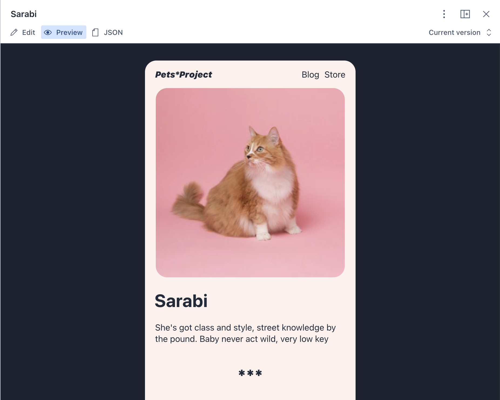
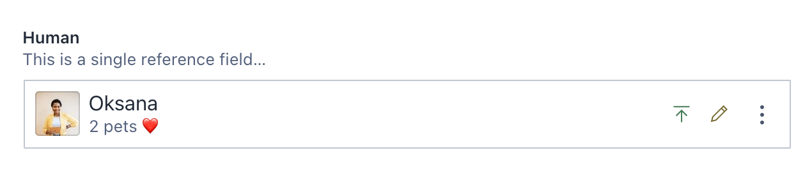
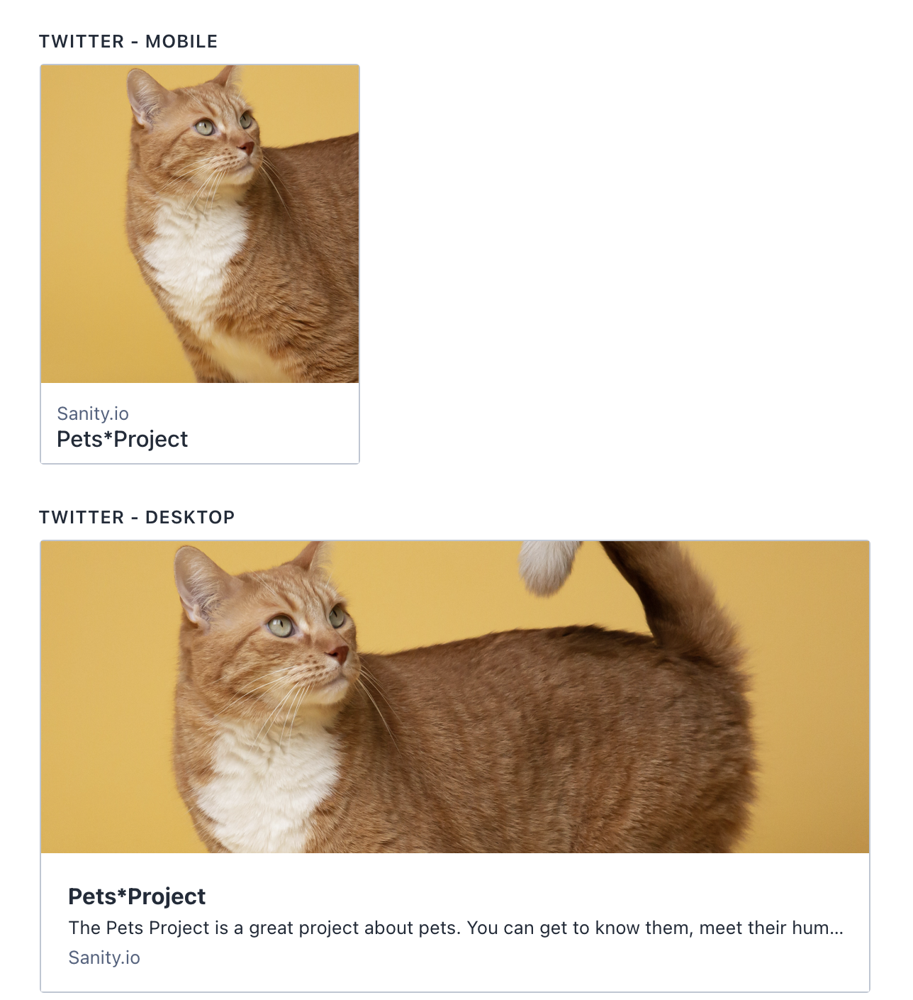
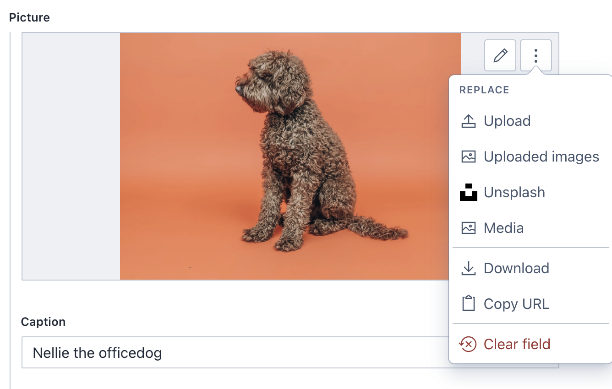
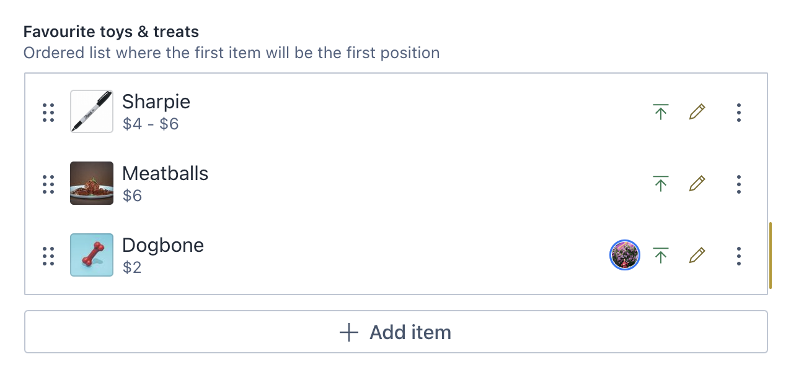

# Sanity 🐶🐱 Pets\*Project

Congratulations, you have now installed the template 🐶🐱 Pets\*Project studio, an open source real-time content editing environment connected to the Sanity backend.

Here are some features that we already have set up so you can explore at your own pace:

- **Customised document previews**: You can quickly and visually test the data that will be used by the front end directly in the studio. ([documentation](https://www.sanity.io/blog/evolve-authoring-experiences-with-views-and-split-panes))

- **References input**: You can edit (and create) document types from a different document with a different schema (for example, you can create a `human` and assign it immediately to a `pet` that you were already editing! ) ([documentation](https://www.sanity.io/docs/reference-type))

- **Image input: crop and hotspot (and how that affects different elements)**: With the hotspot and crop tool in the image input you can very quickly narrow down to which part of the image you want to focus on without having to upload different assets ([documentation](https://www.sanity.io/docs/image-type#hotspot-3e6da78954a8))

- **Image input: use Unsplash and Media browser plugins from the start!**: You can test out how the Unsplash and Media browser plugins are used and explore how to they were set them up ([documentation](https://www.sanity.io/plugins?category=assetSource))

- **Array input types**: you can see how the array inputs were used (in conjunction with references in places) and how we were able to use them in the previews by using groq ([documentation](https://www.sanity.io/docs/array-type))

- **GROQ**: See how we've used groq in the previews to fetch data and how we've read it on the rendering of the component. In the examples, we make sure that you can not only fetch the published last version but the drafts that haven't been published as well ([documentation](https://www.sanity.io/docs/query-cheat-sheet))

If you want to explore more:

- [Read “getting started” in the docs](https://www.sanity.io/docs/introduction/getting-started?utm_source=readme)
- [Join the community Slack](https://slack.sanity.io/?utm_source=readme)
- [Extend and build plugins](https://www.sanity.io/docs/content-studio/extending?utm_source=readme
