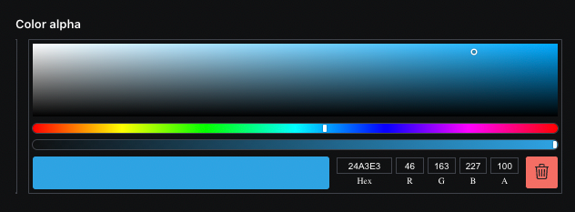
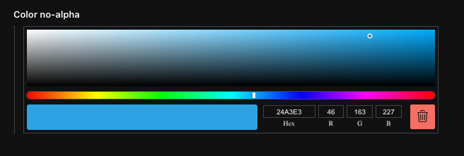
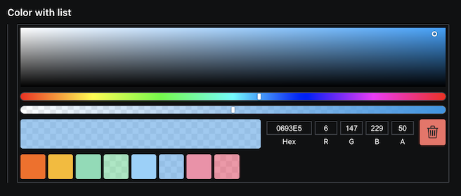

# @sanity/color-input

> This is a **Sanity Studio v3** plugin.
> For the v2 version, please refer to the [v2-branch](https://github.com/sanity-io/sanity/tree/next/packages/%40sanity/color-input).

## What is it?

Color input plugin for [Sanity](https://sanity.io/) that stores selected colors in hex, hsl, hsv and rgb format.



## Installation

```
npm install --save @sanity/color-input
```

or

```
yarn add @sanity/color-input
```

## Usage

Add it as a plugin in sanity.config.ts (or .js):

```js
import {colorInput} from '@sanity/color-input'

export default defineConfig({
  // ...
  plugins: [colorInput()],
})
```

Now you can use the `color` type in your schema types:

```js
// [...]
{
  fields: [
    // [...]
    {
      name: 'favoriteColor',
      title: 'Favorite color',
      type: 'color',
    },
  ]
}
```

## Options

### Disable alpha

To disable the alpha option, set `disableAlpha` to `true`:

```js
// ...fields...
{
  name: 'favoriteColor',
  title: 'Color no-alpha',
  type: 'color',
  options: {
    disableAlpha: true
  }
}
```

Which will render accordingly:



### Color list

To add list of predefined selectable color swatches for the user to choose from use `colorList`.
This uses the `react-color` under the hood https://casesandberg.github.io/react-color/#api-color

```js
// ...fields...
{
  name: 'favoriteColor',
  title: 'Color with list',
  type: 'color',
  options: {
    colorList: [
      '#FF6900',
      { hex: '#FCB900' },
      { r: 123, g: 220, b: 181 },
      { r: 0, g: 208, b: 132, a: 0.5 },
      { h: 203, s: 95, l: 77, a: 1 },
      { h: 202, s: 95, l: 46, a: 0.5 },
      { h: 345, s: 43, v: 97 },
      { h: 344, s: 91, v: 92, a: 0.5 },
    ]
  }
}
```

Which will render accordingly:



## Data model

```js
{
  _type: 'color',
  hex: '#29158a',
  alpha: 0.9,
  hsl: {
    _type: 'hslaColor',
    h: 249.99999999999994,
    s: 0.7328000000000001,
    l: 0.313,
    a: 0.9
  },
  hsv: {
    _type: 'hsvaColor',
    h: 249.99999999999994,
    s: 0.8457987072945522,
    v: 0.5423664,
    a: 0.9
  },
  rgb: {
    _type: 'rgbaColor',
    r: 41
    g: 21,
    b: 138,
    a: 0.9
  }
}
```

## License

MIT-licensed. See LICENSE.

## Develop & test

This plugin uses [@sanity/plugin-kit](https://github.com/sanity-io/plugin-kit)
with default configuration for build & watch scripts.

See [Testing a plugin in Sanity Studio](https://github.com/sanity-io/plugin-kit#testing-a-plugin-in-sanity-studio)
on how to run this plugin with hotreload in the studio.

### Release new version

Run ["CI & Release" workflow](https://github.com/sanity-io/color-input/actions/workflows/main.yml).
Make sure to select the main branch and check "Release new version".

Semantic release will only release on configured branches, so it is safe to run release on any branch.
