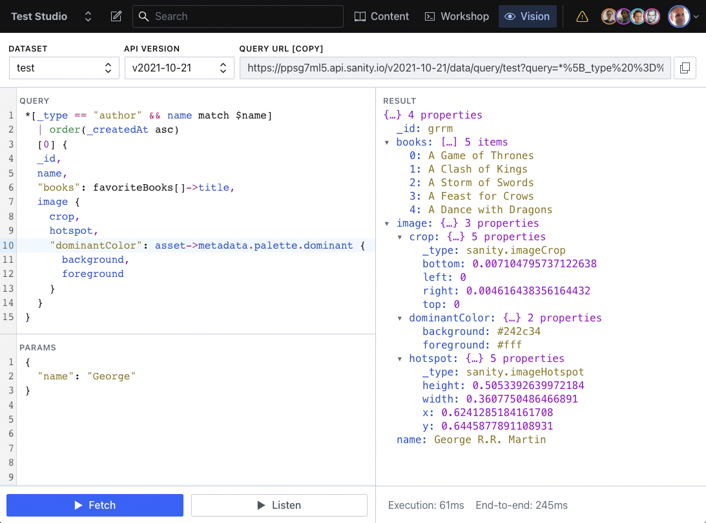

# sanity-vision

Vision is a plugin for Sanity Studio for testing GROQ queries. It features:

- GROQ syntax highlighting so that the query is easier to read
- Parsed response that's more convenient to navigate and explore
- Switching between datasets
- Listening for real-time updates



## Installation

`npm install --save-exact @sanity/vision`

### Configuring

```ts
// `sanity.config.ts` / `sanity.config.js`:
import {defineConfig} from 'sanity'
import {visionTool} from '@sanity/vision'

export default defineConfig({
  // ...
  plugins: [
    visionTool({
      // Note: These are both optional
      defaultApiVersion: 'v2021-10-21',
      defaultDataset: 'some-dataset',
    }),
  ],
})
```

### Only enabling it for development

If you only want the Vision tool available in development (e.g., not in deployed studios), you can import and use the `isDev` constant from the `sanity` package:

```ts
// `sanity.config.ts` / `sanity.config.js`:
import {defineConfig, isDev} from 'sanity'
import {visionTool} from '@sanity/vision'

const devOnlyPlugins = [visionTool()]

export default defineConfig({
  // ...
  plugins: [
    // ... your other plugins here ...
    ...(isDev ? devOnlyPlugins : []),
  ],
})
```

### Only enabling it for administrators

If you only want the Vision tool available to administrators, you can use the [Tool API](https://www.sanity.io/docs/studio-tools) to filter out the tool based on role:

```ts
// `sanity.config.ts` / `sanity.config.js`:
import {defineConfig} from 'sanity'
import {visionTool} from '@sanity/vision'

export default defineConfig({
  // ... name, title, projectId, dataset, etc.
  plugins: [
    // ... your other plugins here ...
    visionTool(),
  ],
  tools: (prev, {currentUser}) => {
    const isAdmin = currentUser?.roles.some((role) => role.name === 'administrator')

    // If the user has the administrator role, return all tools.
    // If the user does not have the administrator role, filter out the vision tool.
    return isAdmin ? prev : prev.filter((tool) => tool.name !== 'vision')
  },
})
```

## License

MIT-licensed. See LICENSE.
