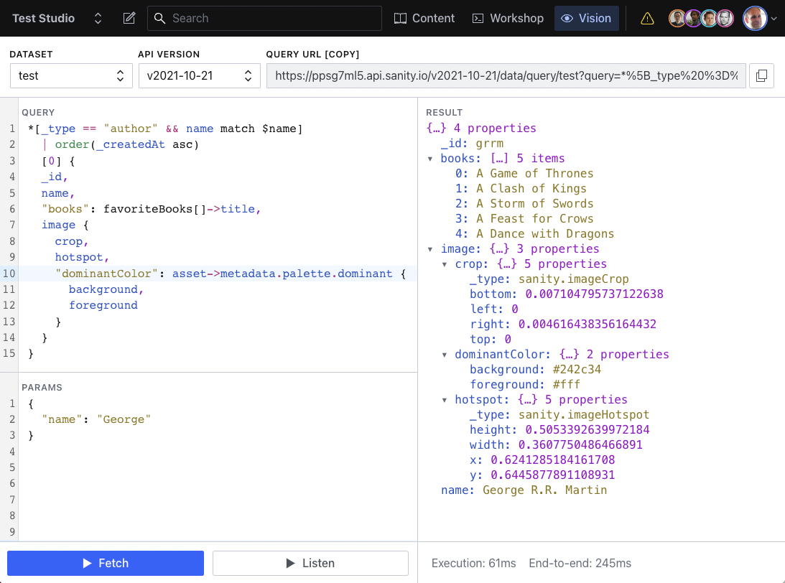

# sanity-vision

Vision is a plugin for Sanity Studio for testing GROQ queries. It features:

- GROQ syntax highlighting so that the query is easier to read
- Parsed response that's more convenient to navigate and explore
- Switching between datasets
- Listening for real-time updates



## Installation

`npm install --save-exact @sanity/vision`

### Configuring

```ts
// `sanity.config.ts` / `sanity.config.js`:
import {defineConfig} from 'sanity'
import {visionTool} from '@sanity/vision'

export default defineConfig({
  // ...
  plugins: [
    visionTool({
      // Note: These are both optional
      defaultApiVersion: 'v2021-10-21',
      defaultDataset: 'some-dataset',
    }),
  ],
})
```

### Only enabling it for development

If you only want the Vision tool available in development (e.g., not in deployed studios), you can import and use the `isDev` constant from the `sanity` package:

```ts
// `sanity.config.ts` / `sanity.config.js`:
import {defineConfig, isDev} from 'sanity'
import {visionTool} from '@sanity/vision'

const devOnlyPlugins = [visionTool()]

export default defineConfig({
  // ...
  plugins: [
    // ... your other plugins here ...
    ...(isDev ? devOnlyPlugins : []),
  ],
})
```

### Only enabling it for administrators

If you only want the Vision tool available to administrators, you can use the [Tool API](https://www.sanity.io/docs/studio-tools) to filter out the tool based on role:

```ts
// `sanity.config.ts` / `sanity.config.js`:
import {defineConfig} from 'sanity'
import {visionTool} from '@sanity/vision'

export default defineConfig({
  // ... name, title, projectId, dataset, etc.
  plugins: [
    // ... your other plugins here ...
    visionTool(),
  ],
  tools: (prev, {currentUser}) => {
    const isAdmin = currentUser?.roles.some((role) => role.name === 'administrator')

    // If the user has the administrator role, return all tools.
    // If the user does not have the administrator role, filter out the vision tool.
    return isAdmin ? prev : prev.filter((tool) => tool.name !== 'vision')
  },
})
```

## Beta: the redesigned Vision

Vision ships an opt-in redesign behind the `beta.redesign` option. It is off by default. When enabled, the classic tool shows a dismissible toast inviting users to try the redesign; users who accept get the redesigned tool, remembered per project in their browser, and can switch back at any time from its sidebar or settings (or by clearing its storage).

```ts
// `sanity.config.ts` / `sanity.config.js`:
import {defineConfig} from 'sanity'
import {visionTool} from '@sanity/vision'

export default defineConfig({
  // ...
  plugins: [
    visionTool({
      beta: {redesign: {enabled: true}},
    }),
  ],
})
```

What is different in the redesign:

- **Query tabs**, each with its own query, params and options (dataset, API version, perspective, content source map). Drag a tab (or press Shift with an arrow key) to reorder them; tabs and their order are persisted per project in `localStorage`.
- **Query, Params and Options stacked** in the request column, all visible at once: the editor takes whatever the two panels leave over, Params grow with their JSON (drag their top edge for another height, double-click it to fit the content again) and Options are as tall as their fields. Both panels collapse to a header, remembered per project.
- **A collapsible sidebar** with your saved queries, the queries shared in the dataset, the keyboard shortcuts and the settings. Saved queries are shared with the classic tool.
- **Refetch automatically**: the response's `syncTags` are matched against the Live Content API, so the result updates when the documents it depends on change. The History panel records every fetch and why it happened.
- **Response details**: execution and end-to-end time, payload size, sync tags, the query URL and the content source map when requested.
- **Exports**: the query as `curl`, `@sanity/client` and `next-sanity` snippets; the result as JSON or CSV, and as TypeScript types or a Zod schema inferred from the workspace schema (falling back to the fetched result).
- **Prettify** reformats the query, and pasting a query URL from the network tab loads it into the active tab.

The redesign is in beta: its look and feature set may still change.

## License

MIT-licensed. See LICENSE.
