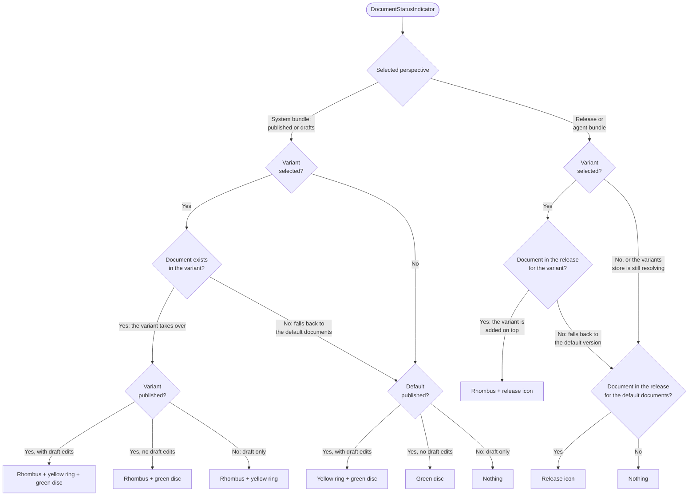

# DocumentStatusIndicator

Which icons render for a document, given what is selected in the perspective bar. The same rules are
written out in prose in the doc comment on `DocumentStatusIndicator`, and every case below has a row
in the `document-status-debug` tool in the test studio.

Notes that the chart leaves out:

- Icons always render in a fixed order, whichever branch produced them: rhombus, release icon,
  yellow ring, green disc. At most three render at once.
- The release icon varies with the release: a bolt, clock, or dot by release type, and a
  suggest-toned dot for agent bundles, which have no release document.
