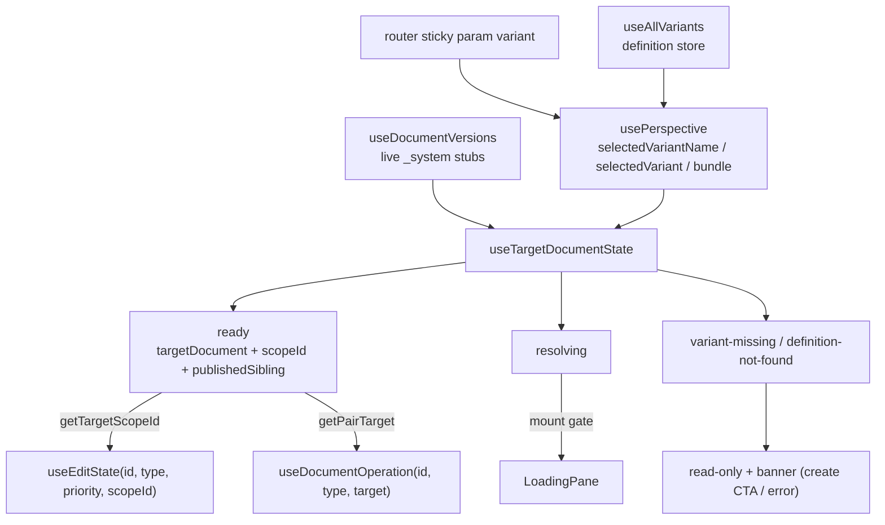

# Variant Document Editing — Architecture

This document explains how document variant editing works in the Studio. It is the onboarding reference for anyone — person or agent — touching this code. Companion documents:

- [`ACTIONS.md`](./ACTIONS.md) — the backend action payloads (`sanity.action.variant.*` and `sanity.action.document.variant.*`) with verified behavior.
- [`README.md`](./README.md) — the Variants _tool_ (definition management UI at `/variants`), which is a separate surface from document editing.

## 1. What a variant is

A **variant definition** is a system document describing a condition set under which alternative content applies (for example `locale: fr` or `audience: loyal-customers`):

- Type `system.variant`, id path `_.variants.<suffix>` (`VARIANT_DOCUMENTS_PATH` in `store/constants.ts`), shape `SystemVariant` in [`types.ts`](./types.ts) — `conditions: Record<string, string>`, `priority`, optional `metadata.title`.
- Definitions are managed through the Variants tool and fetched studio-wide by `useAllVariants` (a `listenQuery`-backed store).

A **variant document** is alternative content for a base document under one variant. It is a _version document_:

```
versions.<scopeId>.<groupId>
```

- `groupId` is the base published id.
- `scopeId` is an **opaque, server-generated hash**. This is the single most important constraint in the whole design: the Studio can never compute or guess a variant document's id. It can only _discover_ it by lookup.

Every variant document carries authoritative metadata in `_system` (typed as `DocumentSystem` in `@sanity/types`):

| `_system` field | Meaning                                                                                                   |
| --------------- | --------------------------------------------------------------------------------------------------------- |
| `variant`       | Reference to the variant definition (`_.variants.*`)                                                      |
| `group`         | Reference to the base published id (the document group)                                                   |
| `bundleId`      | Which bundle the document belongs to: `'drafts'`, a release id, or **unset for the variant-of-published** |
| `scopeId`       | The opaque hash from the document's own id                                                                |
| `release`       | Reference to the release document, for release-scoped versions                                            |
| `delete`        | Soft-unpublish marker set by `variant.unpublish` on release-scoped variants                               |

So for one base document and one variant, up to three sibling documents can exist:

| Document             | Id shape                     | `_system.bundleId` |
| -------------------- | ---------------------------- | ------------------ |
| Variant-of-published | `versions.<hashA>.<groupId>` | _(unset)_          |
| Variant-of-drafts    | `versions.<hashB>.<groupId>` | `'drafts'`         |
| Variant-of-release   | `versions.<hashC>.<groupId>` | `<releaseId>`      |

Each sibling has its **own** scope hash. The base `published`/`drafts.` pair is a fourth and fifth document that variants never touch.

## 2. The core design decision: ride the version slot

Three options were evaluated: an async id-pair resolver (rejected — it breaks hard invariants across the codebase, from `getIdPairFromPublished` throwing on version ids to `@sanity/id-utils` branding `PublishedId`/`DraftId` as disjoint types), removing the document pair entirely (the long-term direction, but far too large to do now), or reusing the existing version machinery. We chose the last one: **a variant document occupies the `versionId` slot of the existing `IdPair`**, exactly like a release version does.

```
IdPair = {
  publishedId: <groupId>                      // base published — untouched
  draftId:     drafts.<groupId>               // base draft — untouched
  versionId:   versions.<scopeId>.<groupId>   // the variant document being edited
}
```

Consequences that shape everything below:

- `editState.draft` / `editState.published` keep describing the **base** pair; `editState.version` is what the user is editing. Identical to release editing.
- Because scope ids are opaque, target resolution is **asynchronous** — a lookup must finish before the pair can be checked out. Releases never had this problem (release version ids are derivable via `getVersionId(id, releaseId)`).
- A missing variant document has no derivable id, so the release-style "create the version locally on first keystroke" flow is **impossible** for variants. Creation goes through a backend action (§8).
- The bundle segment of a variant id is a hash, **not** a release id. Any code that runs `getVersionFromId(id)` and matches the result against releases must fail soft for variants.

## 3. Selecting a variant

- The selection lives in the router sticky param `variant` (the short definition id, e.g. `variant=french`). `useSetVariant` writes it (optionally updating the `perspective` sticky param atomically).
- `PerspectiveProvider` exposes on `usePerspective()`:
  - `selectedVariantName` — the **raw** sticky param, available synchronously. Use this to know "a variant is requested" before anything has loaded.
  - `selectedVariant` — the resolved `SystemVariant` definition. `undefined` while definitions load _or_ when the name matches nothing, so it is ambiguous on its own — never treat it as "no variant selected".
  - `bundle` — the canonical bundle id of the selected perspective: `'published'`, `'drafts'`, or a release id. Variant + bundle together select _which_ sibling is being edited.

## 4. Target resolution: `useTargetDocumentState`

This hook (in `core/hooks/useTargetDocumentState.ts`) is the heart of the system and the entry point almost everything else builds on. It answers: _given the selected perspective and variant, which actual document is the target — and do we know yet?_

Inputs:

- `useDocumentVersions(documentGroupId)` — live stubs of every document in the group (`VersionInfoDocumentStub`: `_id`, `_rev`, `_updatedAt`, `_system`), kept fresh via `observePaths`. For unmigrated documents without `_system`, `temporarilyBuildDocumentSystem` synthesizes it from the id shape.
- `usePerspective()` — `bundle`, `selectedVariant`, `selectedVariantName`.
- `useAllVariants().loading` — because definition loading and stub loading are **two separate async resolutions**; gating on only one reintroduces silent fallbacks.

The stub matching is pure (`core/util/getTargetDocument.ts`): a stub matches when its `_system.bundleId` equals the bundle (unset ≙ `'published'`) _and_ its `_system.variant._ref` equals the selected variant (or is absent when no variant is selected).

Output — a discriminated union, shaped by what consumers must _do_, not just what was observed:

| Status                                  | Meaning                                                                                                       | Consumer obligation                                         |
| --------------------------------------- | ------------------------------------------------------------------------------------------------------------- | ----------------------------------------------------------- |
| `resolving`                             | A lookup (definitions or stubs) is in flight                                                                  | Never fall back to the base pair; treat as not ready        |
| `ready`                                 | Resolution finished. Carries `targetDocument` (stub or `undefined`), `scopeId`, `variant`, `publishedSibling` | Base pair applies only when `variant` is `undefined`        |
| `variant-missing`                       | Variant selected, no variant document in this bundle. Carries `publishedSibling`                              | Read-only; offer creation; never fall back to the base pair |
| `variant-definition-document-not-found` | The sticky param names no definition                                                                          | Error banner; never treated as "no variant"                 |

`publishedSibling` is the variant-of-published stub for the selected variant regardless of the current bundle, found by `getVariantPublishedSibling`. It answers "is this _variant_ published?" — the base `published` document says nothing about that. It rides on `variant-missing` too, so consumers can distinguish "exists published, missing here" from "never existed".

Two mapping helpers convert the state for downstream layers:

- `getTargetScopeId(state)` — the scope id to thread into version-aware hooks (`useEditState`, `useSyncState`, permissions); `undefined` unless `ready`.
- `getPairTarget(state)` — the `DocumentPairTarget` for `useDocumentOperation` (§6): `resolving → {kind: 'unresolved'}`, missing/invalid → `{kind: 'target-missing'}`, resolved variant → `{kind: 'variant', scopeId, variantId}`, plain release → the release id string.



## 5. Mount gate and pane wiring

`DocumentPane.tsx` blocks mounting the editing subtree while a variant is requested (`selectedVariantName` set — the synchronous signal) and the target is `resolving`, rendering `LoadingPane` instead. This guarantees listeners and patches are never wired against the wrong documents during resolution.

The `DocumentPaneProviderWrapper` key includes the resolved target identity (variant name + target document id/status), so any target transition — variant switched, variant document created or discarded while open, release publish moving content — **remounts** through the gate instead of falling back in place. This also prevents form state reuse across variant switches.

`DocumentPaneProvider` resolves `targetDocumentState` once and puts it on the pane context; in-pane consumers read it from `useDocumentPane()`. Out-of-pane consumers (`DocumentEventsPane`, dialogs, diff components) call the hook directly — it is cheap because the underlying stores are shared.

`readOnly` is derived centrally: `variant-missing`, `variant-definition-document-not-found`, and `resolving`-with-a-variant-requested all force read-only. Two banners cover the non-ready variant states: `DocumentNotInVariantBanner` (with the "Add to variant" create CTA) and `VariantDefinitionNotFoundBanner`.

`useDocumentForm` threads `getTargetScopeId(...)` into `useEditState`/`useConnectionState`/`useDocumentSyncState`, passes `getPairTarget(...)` to `useDocumentOperation`, keys its variant-only value branches off `isVariantTarget` (not a truthy scope id, so release targets keep release code paths), and computes `targetDocumentId` from the resolved stub — falling back to bundle-derived ids only for documents that don't exist yet (which for variants can only mean the base flows, since variant ids are opaque).

## 6. Store layer: honest edit state and guarded operations

**`useEditState(publishedId, type, priority, version?)`** — the 4th parameter is the bundle segment: a release id for releases, the opaque `scopeId` for variants, `undefined` for the base pair. It flows to `getIdPair(publishedId, {version})`, which builds the `versionId` slot.

**`EditStateFor`** gained `scopeId` and an honest `release`: for variant-scoped versions (classified from the version snapshot's `_system.variant` — authoritative, immune to memoization mismatches) `release` is `undefined`. Before this, `release` was `getVersionFromId(versionId)`, which would have leaked scope hashes into release matching, intent URLs, and rendering.

**`DocumentPairTarget`** is how callers declare intent to the store, because the store cannot detect a missing variant on its own (it only ever receives a resolved scope id, which is absent exactly when the target is missing):

```ts
{kind: 'version'; name: string}                         // plain release target
{kind: 'variant'; scopeId: string; variantId: string}   // resolved variant target
{kind: 'target-missing'; variantId?: string}            // declared target has no document
{kind: 'unresolved'}                                    // resolution still in flight
```

`pair.editOperations` / `useDocumentOperation` accept `string | DocumentPairTarget`. `document-store.ts` branches **before** pair checkout: `unresolved` → `GUARDED` (all operations disabled `NOT_READY`), `target-missing` → `TARGET_NOT_FOUND_OPERATIONS` (all disabled `TARGET_NOT_FOUND`); both throw if executed anyway. Read paths (`editState`, `documentEvents`, sync/connection) intentionally keep accepting plain strings — for a missing variant they must keep serving the base pair read-only (the banner forks from the base value).

Independently, `createOperationsAPI` self-derives a guard from its own snapshots: if `idPair.versionId` is set but the version snapshot is `null`, the mutating operations (`patch`, `commit`, `publish`, `unpublish`, `discardChanges`) are disabled with `TARGET_NOT_FOUND` — including for brand-new documents, since versions are never created by patching them into existence. This codifies at store level what previously lived only in `useDocumentForm`. `restore` and the group-level `delete`/`duplicate` are deliberately excluded. Note this guard **only applies when a version is requested** — base drafts are still created as you type.

`useDocumentForm` treats `patch.disabled` like `readOnly` in the `patchRef` assignment and throws if a patch is attempted anyway — disabling alone isn't enough because `patch.execute` was historically called without checking `disabled`.

## 7. Operations: routing to the variant actions (the corruption-critical layer)

**Why this is the dangerous part:** the base publish action sends `publishedId: idPair.publishedId`. Run against a variant version in the pair, it would publish variant content **into the base published document** — data corruption, not a broken button.

**Routing discriminator:** `getVariantVersionInfo(version)` in [`documents/getVariantVersionInfo.ts`](./documents/getVariantVersionInfo.ts) derives `{variantId, bundleId}` from the version snapshot's `_system` (`bundleId` defaults to `'published'` when unset). The _snapshot_ is authoritative — routing never derives from the perspective, so it stays correct through races and future refactors.

The server operations (`store/document/document-pair/serverOperations/`) branch on it:

| Operation        | Variant routing                                                                                                                                                                                                                                                                                     | Disabled matrix for variants                                                                                                                  |
| ---------------- | --------------------------------------------------------------------------------------------------------------------------------------------------------------------------------------------------------------------------------------------------------------------------------------------------- | --------------------------------------------------------------------------------------------------------------------------------------------- |
| `publish`        | `sanity.action.document.variant.publish` `{publishedId, variantId, bundleId}` — publishes the variant document into the variant-of-published; base never touched                                                                                                                                    | `ALREADY_PUBLISHED` when the target _is_ the variant-of-published; `NOT_PUBLISHABLE` for release-scoped variants (published with the release) |
| `unpublish`      | `sanity.action.document.variant.unpublish` — `bundleId: undefined` for the variant-of-published (**hard** unpublish: published variant deleted, content recreated as the variant draft) or the release id (**soft** unpublish: `_system.delete: true` marker, completed when the release publishes) | `NOT_PUBLISHED` for drafts-scoped variants                                                                                                    |
| `discardChanges` | `sanity.action.document.variant.delete` `{publishedId, variantId, bundleId}` — the generic `document.discard` addresses drafts by raw id; variants are addressed by coordinates                                                                                                                     | `NO_CHANGES` for the variant-of-published (removing it is unpublish's job)                                                                    |
| `delete`         | Intentionally unrouted — the group delete/version-discard actions accept variant version ids                                                                                                                                                                                                        |                                                                                                                                               |
| `duplicate`      | Kept as-is (product decision): duplicating under a variant target copies the variant content into a new **base** draft                                                                                                                                                                              |                                                                                                                                               |

Action typings live in [`store/variantsClient.ts`](./store/variantsClient.ts) (temporary until `@sanity/client` exports them); the operations use `variantActionsApiClient` for the correct API version. No optimistic locks are sent yet — the deployed actions reject `ifSourceRevisionId`/`ifPublishedRevisionId` (TODO in `serverOperations/publish.ts`).

**Tripwires (defense-in-depth):** `assertNotVariantVersion` throws before the base publish/unpublish actions can execute against a variant-scoped version, and every legacy transaction-based operation in `operations/*.ts` is disabled with `VARIANT_VERSION` via `disabledForVariantVersion`. Normal routing makes these unreachable; they exist because the failure mode of a silent fallthrough is corruption.

## 8. Creating variant documents

Because ids are opaque, creation is a backend action, not a local mutation:

- `sanity.action.document.variant.create` (`documents/createVariantScopedDocument.ts`, surfaced through `useVariantDocumentOperations` and the `DocumentNotInVariantBanner` CTA) copies a source document's fields into a new variant-scoped version for the given `{publishedId, variantId, bundleId}`.
- The target bundle follows the selected perspective: `undefined` (published), `'drafts'`, or a release id.
- After the action resolves, the new stub must arrive through `useDocumentVersions` before editing can start; the pane's remount keying handles the transition, and a delayed toast covers the propagation window.

## 9. Publish-state UI, diffs, and history from the sibling

The pair holds only the variant document for the _current_ bundle. Everything that asks "is this variant published, and what does the published variant look like?" needs the **variant-of-published sibling**, which is in no pair slot. It is plumbed from `targetDocumentState.publishedSibling` (a live stub — `_rev`/`_updatedAt`/`scopeId` — so gating needs no second pair listener):

- **`PublishAction`** — already-published tooltip timestamps and publish-completion tracking read the sibling. (Completion is detected by the published `_rev` changing; the base `_rev` never changes on a variant publish, so without this every successful variant publish reported failure.) The base "already published" shortcut is skipped whenever a variant is selected.
- **`UnpublishAction` / `UnpublishVersionAction`** — "is there anything published to unpublish" comes from sibling existence, not `editState.published`.
- **`DiscardChangesAction`** — the confirm-dialog copy ("revert to published" vs "delete document") switches on the sibling.
- **`CompareWithPublishedView`** (review changes) — diffs the displayed variant against the variant-of-published _document_, checked out via the sibling's scope id through `useEditState` (the one place a second pair listener is justified); hidden when the variant has never been published.
- **`DocumentEventsPane`** — history events are fetched for `targetDocumentState.targetDocument._id`. The old derivation `getVersionId(id, perspectiveName)` can never produce a variant id (the perspective name is not the scope hash).
- **History restore** — `serverOperations/restore.ts` targets `idPair.versionId`; `createHistoryStore` derives its actions client from the _target_ id (this also fixed a latent bug where release restores used the wrong API version).
- **`getEditEvents`** — attribution fails soft for variants: `releaseId` carries the opaque hash, which can never collide with a real release name (regression-tested).
- `useDocumentIdStack` is **unchanged**: variants are resolved by a separate API parameter and do not participate in the perspective stack.

## 10. Invariants — the "never do" list

These are the rules that keep the system correct. Violating any of them reintroduces a failure mode that was deliberately engineered away:

1. **Never compute or guess a variant scope id client-side.** They are server-generated hashes. Discovery is only via `useDocumentVersions` stubs.
2. **Never fall back to the base pair while a variant is unresolved.** `selectedVariant === undefined` is ambiguous (loading vs none selected); gate on `selectedVariantName` + the explicit `resolving` status. A patch issued during a fallback window writes to the base draft.
3. **Never treat a version id's bundle segment as a release id without failing soft.** For variants it is an opaque hash. `editState.release` is already classified honestly; new code doing `getVersionFromId(...)` must tolerate hashes.
4. **Route operations off the snapshot's `_system`, not the perspective.** `getVariantVersionInfo` is the single discriminator.
5. **Never let a base publish/unpublish execute against a variant version.** The tripwires (`assertNotVariantVersion`, `disabledForVariantVersion`) must survive refactors.
6. **Read variant publish state from `publishedSibling`, not `editState.published`.** The base published document says nothing about the variant.
7. **Infer loading from `loading` flags, never from stub presence.** `useDocumentVersions` emits `{loading: true, versions: []}` while fetching.
8. **Declare targets to the store.** New operation call sites must pass `getPairTarget(targetDocumentState)`, not a bare scope id, or they lose the `unresolved`/`target-missing` guards.

## 11. What is not done yet

- **Permissions**: `documentPairPermissions` does not yet accept a target kind; variant grants are still checked against base-derived ids. The grants-engine match on `versions.<hash>.*` paths needs early manual verification.
- **Peripheral subsystems**: comments scoping, presence scoping (group-level vs variant), UI truthfulness gates keyed on `!draft && !published`, Presentation/scheduled-publishing guards.
- **Optimistic locks**: blocked on the deployed variant actions accepting `ifSourceRevisionId`/`ifPublishedRevisionId`.

## 12. Map of key files

| Area              | Files                                                                                                                                                                                                                                                        |
| ----------------- | ------------------------------------------------------------------------------------------------------------------------------------------------------------------------------------------------------------------------------------------------------------ |
| Types & constants | `variants/types.ts`, `variants/store/constants.ts`, `@sanity/types` `DocumentSystem`                                                                                                                                                                         |
| Selection         | `perspective/PerspectiveProvider.tsx`, `perspective/useSetVariant.tsx`, `variants/store/useAllVariants.ts`                                                                                                                                                   |
| Resolution        | `hooks/useTargetDocumentState.ts`, `util/getTargetDocument.ts`, `releases/hooks/useDocumentVersions.tsx`, `releases/util/temporarilyBuildDocumentSystem.ts`                                                                                                  |
| Pane wiring       | `structure/panes/document/DocumentPane.tsx` (mount gate + keying), `DocumentPaneProvider.tsx`, `documentPanel/banners/DocumentNotInVariantBanner.tsx`, `VariantDefinitionNotFoundBanner.tsx`, `core/form/useDocumentForm.ts`                                 |
| Store & guards    | `store/document/document-store.ts`, `store/document/types.ts` (`DocumentPairTarget`), `document-pair/editState.ts`, `document-pair/operations/helpers.ts` (`GUARDED`, `TARGET_NOT_FOUND_OPERATIONS`, self-derived guard), `hooks/useDocumentOperation.ts`    |
| Operation routing | `variants/documents/getVariantVersionInfo.ts`, `document-pair/serverOperations/{publish,unpublish,discardChanges}.ts`, `document-pair/utils/{assertNotVariantVersion,variantActionsApiClient}.ts`, `variants/store/variantsClient.ts`, `variants/ACTIONS.md` |
| Creation          | `variants/documents/createVariantScopedDocument.ts`, `variants/hooks/useVariantDocumentOperations.ts`                                                                                                                                                        |
| Publish-state UI  | `structure/documentActions/{PublishAction,UnpublishAction,DiscardChangesAction}.tsx`, `releases/plugin/documentActions/UnpublishVersionAction.tsx`                                                                                                           |
| Diffs & history   | `structure/panes/document/inspectors/changes/EventsInspector.tsx`, `structure/panes/document/DocumentEventsPane.tsx`, `store/events/getEditEvents.ts`, `store/history/createHistoryStore.ts`, `document-pair/serverOperations/restore.ts`                    |
