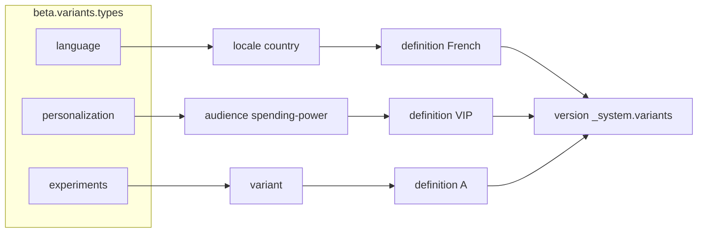
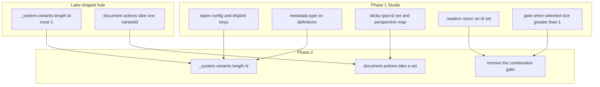

# Multiple variant types in Studio

This note is for Studio. Presentation, preview cookies, and the live-site resolver are out of scope.

It is not a dump of the finished product. It is **what we do now**, **what we do once Content Lake accepts more than one variant ref on a document**, and **why the now work is that later model with a lake-shaped hole** — not a throwaway single-dropdown UI we would replace.

Today a content version belongs to at most one variant definition. [#14762](https://github.com/sanity-io/sanity/pull/14762) already stores that membership as `_system.variants` (an array). Content Lake still rejects more than one entry, and every Studio reader uses `variants[0]` in `core/util/getDocumentVersionVariant.ts`. We are changing the product from that one-definition world to **multiple orthogonal types on one document** (`language` + `personalization` + `experiments`). The lake is not ready to persist that. Studio can still land the config, the definitions, and the selection model so the day the cap lifts we fill a set we already speak, instead of redesigning the Studio contract.

**Why the Studio half can land now.** `beta.variants.conditions` (static list or async resolver) is still unreleased. It exists on this branch and in in-repo studios, not as a shipped beta contract. Land `types` as the first public config shape so we never publish a root `conditions` key we would have to break. There is no compatibility shim for root `conditions`. Fold the in-flight resolver work under each type instead of merging it as-is.

## Target model

A variant **type** is an orthogonal dimension: `language`, `personalization`, `experiments`. A variant **definition** (`system.variant`, id `_.variants.<suffix>`) belongs to exactly one type, stored as `metadata.type` — Studio-owned metadata, same bucket as `title` and `description`. A content version will eventually reference **one definition per type** via `_system.variants`.

Condition **keys are owned by a type**. The same key cannot be declared on two types.

| Type              | Example keys                          |
| ----------------- | ------------------------------------- |
| `language`        | `locale`, `country`                   |
| `personalization` | `audience`, `spending-power`          |
| `experiments`     | `variant` (`variant-a` / `variant-b`) |

`personalization` must not accept `locale`, `country`, or `variant`. One combination of definitions therefore cannot contain the same keys. That is what makes the dimensions combinable: Content Lake matches on the merged condition map, and a collision would be ambiguous.



**View as** selects at most one definition per type.

- A missing type means the **default for that dimension** (no ref of that type), not "any".
- All types on default is the base document — what clearing the sticky `variant` param does today.
- A version matches the selection only when its variant ref set is **exactly** the selected set. French+VIP is not French-only.

There is no hard cap at 3 types. The navbar should wrap cleanly at 3; validation must not reject a fourth. It is the author's choice.

Type keys and condition keys are **separate namespaces**. The default type key is `variant`. An `experiments` type may still own a condition key named `variant`. They do not collide.

## Phase 1 — do now

Everything here can ship while Content Lake still rejects `_system.variants.length > 1`. Single-type studios (`enabled: true` and no `types`) keep working. Multi-type config and navbar are real. Creating or opening a **combination** document is not.

### Config

Put conditions under `beta.variants.types`. Root `conditions` has not shipped; drop that key from the public types rather than supporting both.

`enabled: true` with `types` omitted, empty, or resolving to an empty object does **not** require the author to add config. Studio injects a single default type:

```ts
{variant: {label: 'Variant', conditions: undefined}}
```

`conditions: undefined` is today's freeform key/value rows — what `dev/studio-e2e-testing/sanity.config.ts` already does (`enabled: true` only). In-repo examples that already set root `conditions`, including `dev/test-studio/sanity.config.ts`, move that list under a type in the same change. Those configs are not a customer migration.

```ts
beta: {
  variants: {
    enabled: true,
    types: {
      language: {
        label: 'Language',
        description: 'Locale and country',
        conditions: [
          {name: 'locale', values: ['en', 'fr']},
          {name: 'country', values: ['us', 'fr']},
        ],
      },
      personalization: {
        label: 'Personalization',
        conditions: async (ctx) => loadAudience(ctx),
      },
    },
  },
}
```

Resolution rules:

- `types` is either that object or `(ctx) => object | Promise<object>`. Context stays `projectId`, `dataset`, `getClient`, plus the workspace name the conditions resolver already uses as a cache key (`useVariantConditions.ts`).
- Each type's `conditions` stays an array or a function. The function context gains `type: string`.
- Resolve the `types` function first, then each type's conditions in parallel. Cache per type. One type's failure leaves the others usable and exposes retry on that dropdown only.
- After the resolvers that succeeded have settled, **duplicate keys across types are a hard error** naming both types and the key. Do not drop the key the way `normalizeVariantConditions` drops duplicates inside one list. A type that resolves to zero valid conditions is an error for that type.
- Type keys use the same pattern as condition keys (`[a-z][a-z0-9_-]{0,63}`, no `:`, no `_` / `$` prefix) so they can sit in a sticky `type:id` pair. The default type key `variant` already matches.
- Do not prepend the default type when the author defined their own. The injected `variant` type is only the empty-config fallback.

Wiring today: types in `core/config/types.ts`, reduction in `variantsConditionsReducer` (`core/config/configPropertyReducers.ts`), prepare in `prepareConfig.tsx`. Replace the root `conditions` field and reducer with a `types` field and reducer. Fold `useVariantConditions` so status is per type, not one global mapped/freeform result.

### Definitions

The type lives on the definition as `metadata.type`, not a root field. `SystemVariant.metadata` already exists; `ACTIONS.md` already accepts `metadata` on create and patches under `metadata` / `metadata.*` on edit. The listen projection in `createVariantsStore.ts` already returns `metadata`. No Content Lake schema change, no new GROQ field.

Read rules:

- A definition's type is `metadata.type` when set.
- If it is missing, Studio falls back to the `variant` **type** — the same key as the injected default — not the first key in the author's map. Adding `language` or `personalization` later does not re-home untyped definitions.
- If the author replaced the default entirely and the resolved map has no `variant` type, untyped definitions still resolve as `variant` and stay out of the other dropdowns until they are written.

Write rules:

- Every new create persists `metadata.type`.
- Users with no `types` config therefore store `metadata.type: 'variant'` on every new create.
- Studio treats `metadata.type` as **immutable after create**, even though `sanity.action.variant.definition.edit` would accept a patch. Refuse that change in the form.

The form in `components/dialog/VariantForm.tsx`:

- Shows a type picker **only when more than one type is configured, reuse the conditions picker for types**.
- With a single type (injected default, or a user map with one key), hide the picker and still write that type onto the document.
- Edit never shows the picker: type is already on the document, if more than one type is available, show the type as disabled, users should not change it after creating it.
- Condition rows for that variant may only use the type's keys. Freeform when that type's `conditions` is undefined.
- Uniqueness of a full condition set (`uniquenessValidation.ts`) becomes **per type**. Titles stay unique per type because each dropdown is its own list.
- Open questions: How will we solve future changes to keys and conditions in a variant that is already added to a document? How will Content Lake handle conditions collisions between two variants?

The variants tool table gains a type column; the detail page shows type as read-only.

### Navbar and sticky params

`VariantsStudioNavbar.tsx` renders one `VariantsMenu.tsx` per type, labeled with `label` or the type key. Each menu lists only that type's definitions plus a generic per-type **Default**. Today's "All users (Default)" is audience-specific and must not be reused as the language or experiments empty state.

Sticky param stays the single allowlisted `variant` key in `router/stickyParams.ts`. The value becomes a comma-separated list of `<type>:<id>` pairs, short ids as today (`getVariantId`), segments sorted by type key:

```
?variant=experiments:Ab12cd34,language:Fr12ab34
```

- Clearing one dropdown rewrites the param and leaves the others.
- A bare id (current links, release intents) is read as that definition's type once the variants store has loaded, and is **not stripped** while the store is still loading.
- `useSetVariant` grows a per-type update that still commits `perspective` in the same navigation.
- `PerspectiveProvider` replaces `selectedVariant` / `selectedVariantName` with a **map of type → definition** (plus the raw sticky value for the loading/not-found path).

### Document targeting while the lake is single-ref

Readers switch from `getDocumentVersionVariantId` (one id) to the **full id set**. With the current cap the set length is 0 or 1, so single-type studios keep working. Do not keep a parallel "primary variant" API that Phase 2 would have to delete.

Document panes, lists, banners, and the document-group inventory take that set.

- Selection set length 0 or 1: today's path. Send one `variantId` on document actions. List/listen `variant` stays one id.
- Selection set length > 1: show an explicit **"this combination cannot be opened yet"** state. Do **not** silently use `variants[0]`. Do **not** invent a fake multi-id payload the lake will reject.

Priority stays on the definition. It is the delivery tie-break **inside one type**. The Studio picker does not use it to choose among types, because types cannot overlap.

### Phase 1 checklist

- Config shape (`types` as the first public key), reducer, default `{variant: {label: 'Variant', conditions: undefined}}` when `types` is omitted or empty, cross-type key validation. Fold the unreleased conditions resolver under each type.
- First phase we only accept the type `variant` in the config, later we will accept any type.
- Per-type conditions hook (split today's single status in `useVariantConditions.ts`).
- `metadata.type` on the form, create payload, and store consumers. No new listen field.
- Navbar, sticky encoding, perspective map.
- Readers return a set. Call sites listed under Challenges consume the map in this phase.
- Honest gate when `selected.size > 1`.
- Document actions keep sending one `variantId` when the selection set has one member.

## How Phase 1 aims at Phase 2

We are not building a temporary single-dropdown world and swapping it later. We are building the multi-type world with a lake-shaped hole.

| Phase 1 change                                                                          | Why it is the Phase 2 shape                                                                                                                                                                               |
| --------------------------------------------------------------------------------------- | --------------------------------------------------------------------------------------------------------------------------------------------------------------------------------------------------------- |
| Disjoint condition keys per type                                                        | Combinability rule. When content lake stores N refs, those refs still must not share keys. Validating that in config now means Phase 2 does not invent a second uniqueness model.                         |
| `metadata.type` on every new definition, including default `variant`                    | How Studio groups dropdowns and how we resolve a sticky `type:id` pair. Phase 2 does not need a new root field or a backfill of every existing doc if creates already write the type.                     |
| Sticky `variant` as a set of `type:id` pairs; perspective as a map of type → definition | The selection model the lake will address. Phase 2 fills the set; it does not change the param name or encoding.                                                                                          |
| Readers that return a set                                                               | Phase 2 is "honor length > 1" plus removing the combination gate. Call sites should already consume the map.                                                                                              |
| Honest gate when `selected.size > 1`                                                    | Keeps us from teaching the product that `variants[0]` is the document. When the lake accepts N refs, delete the gate and wire the same set into `createVariantScopedDocument.ts` and listen/list options. |
| Default type `variant`                                                                  | Today's one-variant-per-document world is the **one-type subset** of the same model. Phase 2 does not require every studio to add `types` the day the lake ships.                                         |

What we deliberately do **not** fake while content lake is single-ref:

- Do not write two refs into `_system.variants` and hope the second is ignored.
- Do not invent a client-side composite variant id.
- Do not send a multi-id action payload the lake will reject.
- Do not treat `variants[0]` as "the" document when the user selected two types.



## Phase 2 — once Content Lake supports multi-variant refs

Blocked on the lake. This is the contract Studio needs, not work to do now.

- Allow N entries in `_system.variants`. The array from [#14762](https://github.com/sanity-io/sanity/pull/14762) already exists; the cap is the blocker. Legacy `_system.variant` stays a fallback until migration finishes (`getDocumentVersionVariant.ts`).
- `sanity.action.document.variant.create` / publish / unpublish / duplicate take a **set** of variant ids, not one `variantId` (`documents/createVariantScopedDocument.ts`). Scope ids stay server-generated. Studio must not guess a composite id on the client.
- Listen and list queries accept that set. Until then, list filtering only applies when one type is selected.
- Remove the Phase 1 "combination cannot be opened yet" gate. Exact-set matching (French+VIP is not French-only) becomes the live rule, not just the documented one.
- Banners, create-in-variant, document-group inventory, and pair checkout pass the full selected set through the same Studio APIs Phase 1 already uses.

`metadata.type` does **not** wait on this phase. It is already writable under `metadata`.

## Challenges

### Phase 1

**Untyped existing definitions.** Current `system.variant` documents have no `metadata.type`. Do not omit them. Read them as type `variant` so `enabled: true` with no further config keeps today's single "Variant" dropdown and lists every current definition. New creates in that studio still write `metadata.type: 'variant'` even though the form never shows a picker. A custom `types` map that does not include `variant` leaves those untyped definitions out of the typed dropdowns until they are written — that is expected, not a re-home into the first custom type.

`metadata.type` **is not frozen by the actions API.** `definition.edit` allows patches under `metadata.`*. Studio must refuse a type change on edit and treat a definition whose type no longer matches its condition keys as invalid and not selectable. A later API freeze of `metadata.type` is nice-to-have, not a blocker.

**Stored keys outside the type.** A definition whose keys are not in its type, or that uses a key another type owns, is invalid in the tool and not selectable. Mapped-mode mismatch UI (`getVariantConditionMismatches.ts`) becomes per-type.

**Nested async must not blank every dropdown.** `types` may be a function; each type's `conditions` may be a function. One CDP failure retries on that type's menu only. Do not fail the injected default `variant` type because `personalization` timed out.

**Call sites that assume one** `selectedVariantName`**.** These have to take the map **in Phase 1**, not "when the lake is ready". The list below is from the perspective and document-pane graph, not a second source of truth:

| Surface                              | Path                                                                                                 | Today's assumption                                              |
| ------------------------------------ | ---------------------------------------------------------------------------------------------------- | --------------------------------------------------------------- |
| Perspective context                  | `core/perspective/types.ts`, `PerspectiveProvider.tsx`, `getSelectedVariant.ts`                      | One `selectedVariantName` / `selectedVariant`                   |
| Set variant                          | `core/perspective/useSetVariant.tsx`                                                                 | Writes one short id to `stickyParams.variant`                   |
| Target document                      | `core/hooks/useTargetDocumentState.ts`, `core/util/getTargetDocument.ts`                             | One `variant: VariantId`                                        |
| Version variant id                   | `core/util/getDocumentVersionVariant.ts`                                                             | `variants[0]` only                                              |
| Document pane gate / remount key     | `structure/panes/document/DocumentPane.tsx`                                                          | Keyed on one `selectedVariantName`                              |
| Form / pair / read-only              | `core/form/useDocumentForm.ts`, `DocumentPaneProvider.tsx`                                           | One `variantId` on the pair target                              |
| Lists and structure                  | `structure/panes/documentList/DocumentListPane.tsx`, `StructureToolProvider.tsx`, `structureBuilder` | One `variant` query option                                      |
| Previews                             | `PaneItemPreview.tsx`, `DocumentHeaderBreadcrumbItem.tsx`                                            | One `selectedVariantName`                                       |
| Banners                              | `DocumentNotInVariantBanner.tsx`, `VariantDefinitionNotFoundBanner.tsx`                              | Singular variant title and one create target                    |
| Header badges / chips                | `DocumentTargetBadges.tsx`, `useDocumentPerspectiveList.ts`                                          | At most one variant badge / chip                                |
| Comments, copy link, release intents | `CommentsWrapper.tsx`, `CopyDocumentActions.tsx`, `getReleaseDocumentIntent.ts`                      | Append one `variant` search param                               |
| Document-group inventory             | `core/documentGroupInventory/`                                                                       | Pick one definition, then `setVariant`                          |
| Navbar                               | `VariantsStudioNavbar.tsx`, `VariantsMenu.tsx`                                                       | One pill, one menu, one clear                                   |
| Presentation / Vision                | `presentation/usePresentationVariant.ts`, Vision `getActiveVariant()`                                | Out of this note's implementation scope; still one string today |

**i18n.** `core/variants/i18n/resources.ts` navbar strings are singular (`navbar.variant`, `navbar.variant.default` = "All users (Default)"). Per-type labels come from config. The default item copy cannot stay "All users".

### Phase 2 (document now, do not implement)

**Exact-set matching.** A version tagged French+VIP does not appear when only French is selected. Phase 1 cannot exercise this until a document can hold two refs. Write the target-resolution helper against a set now so Phase 2 is not a rewrite; the combination gate is what keeps the un-exercised path from shipping as behavior.

**Actions and queries grow from one id to a set.** Studio should not guess a composite id on the client. `createVariantScopedDocument`, publish, unpublish, duplicate, listen, and document-list `variant` all wait on a lake contract for a set.

## Out of scope

- Presentation preview (`usePresentationVariant`, `sanity-preview-variant` cookie / query).
- Live-site / delivery matching and the Content Lake condition resolver used at request time.
- A hard limit of three types.
- Moving `type` to a root field on `system.variant`.
- Shipping a root `beta.variants.conditions` key and migrating it later.
